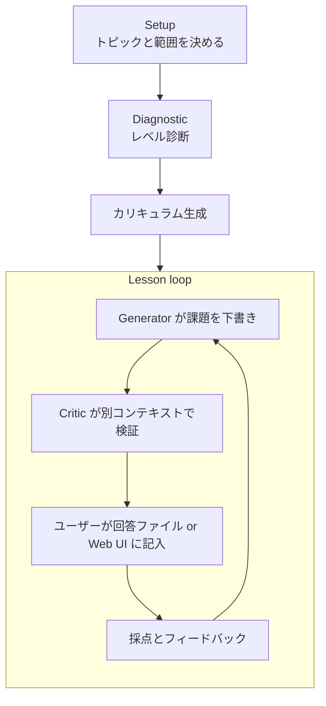

# study-loop（開発中）

English version → [README.md](README.md)

> **⚠️ 未リリースです。** このプラグインは意図的に `dev/` 配下に置いてあります。marketplace から外してあるため `/plugin install study-loop@agent-plugins` は動作せず、コマンド・ファイル形式・挙動は予告なく変わります。以下はすべて現時点の開発スナップショットの説明です。

## なぜ作ったか

AI に「○○を教えて」と頼むと、解説の壁が返ってきます。読むと勉強した気になりますが、身につくかは別の話です。学習科学の研究が一貫して示すのは逆の形——テストされること、記憶から引き出すこと、間隔を空けること、フィードバックを受けること——です。study-loop は「○○を勉強したい」をその形に組み替えます: レベル診断 → 課題ファイル → ユーザーが回答を書く → 採点 → フィードバック → 次の課題。プログラミング・語学・数学・歴史・資格試験など、トピックを選びません。

## 全体像



セッション状態は `.study/<topic-slug>/` 配下の素の Markdown として保存されます: 進捗ダッシュボード・カリキュラム・用語集・フィードバックルール・気づきログ。

## 設計上の判断

- **すべての設計判断がメタ分析・システマティックレビューを出典に持つ** — 効果サイズと出典は `skills/study-loop/references/learning-science.md` に記録: フィードバックの質（Hattie & Timperley、*d* ≈ 0.70–1.00）、Retrieval Practice / テスト効果（Roediger & Karpicke、*d* ≈ 0.50–0.80）、Self-Explanation 効果（Bisra et al.、*g* ≈ 0.55）、Worked Example の段階的な手放し（Sweller / Kalyuga、*d* ≈ 0.5–1.0）、分散学習（Cepeda et al.、*d* ≈ 0.4–0.9）、Interleaved Practice（Brunmair & Richter、*g* ≈ 0.42）、Elaborative Interrogation（Dunlosky et al.、*d* ≈ 0.42）
- **課題を書いた本人にレビューさせない** — 課題は Generator が下書きし、別コンテキストの Critic が検証してからユーザーに届きます。解答がコメントに漏れているといった問題を出題前に捕まえるためです
- **セッション状態はデータベースではなく Markdown** — ループが知っていることはすべて `.study/` 配下の読める・差分が取れるファイルにあり、進捗は目視でき、手で直せて、特定のエージェントにロックインされません
- **Web UI は任意かつ自己完結** — `/study-ui` がローカルの Flask サーバー（`skills/study-loop/scripts/server.py`）を loopback 限定で起動し、ブラウザで lesson の閲覧・回答記入ができます。`/study-ui-stop` で停止。サーバーは `CLAUDE_PLUGIN_ROOT` などの Claude Code 由来の環境変数を一切参照しないので、単独でも動きます（後述）
- **Codex は必要になった瞬間だけ起動** — 採点はローカルの Codex App Server セッション経由でも実行でき、ジョブが必要とするときだけサブプロセスとして起動します。`codex login` していなければ Markdown だけの手動フローにフォールバックします

## clone して試す

インストールせずに Claude Code セッションへ読み込む:

```bash
claude --plugin-dir ./dev/study-loop
```

## Claude Code を使わずに Web UI を単独起動する

リポジトリルートから:

```bash
bash dev/study-loop/skills/study-loop/scripts/start.sh
```

初回実行時は `start.sh` が `bootstrap.sh` を呼び出し、スクリプトと同じ場所に `.venv` を作成して `flask` / `markdown` / `pymdown-extensions` を自動でインストールします。手動セットアップは不要です。

`--backend` は UI が Codex をどう扱うかを決めるフラグです（既定は `auto`）。

- `auto`（既定） — UI で明示的に開始操作（診断開始・採点など）を選んだときだけ Codex を起動します。ページを開いただけ、Markdown を保存しただけでは起動しません。
- `codex` — 現状の実装では `auto` と同じ挙動です。
- `manual` — Codex を一切使いません。すべての採点は Markdown だけを正とする手動フロー（回答ファイルを編集し、Claude Code など別のエージェントに採点してもらう）で行います。

Codex を使う場合の前提は、事前に一度 `codex login` を済ませてあることだけです。ジョブが Codex を必要とするタイミングで `codex_app_server.py` が自分で `codex app-server --stdio` をサブプロセスとして起動し、接続時に認証状態を確認します。ログインしていない場合はその旨が UI に表示され、手動フローにフォールバックします。

その他のフラグ:

- `--port <n>` — 固定ポート。指定しない場合、`start.sh` は 8765 から 8774 まで空きポートを自動で探します。指定した場合は衝突しても別ポートへは自動シフトしません。
- `--root <path>` — Study Loop セッションディレクトリのパス（既定: `$PWD/.study`）。
- `--host <addr>` — bind するアドレス（既定 `127.0.0.1`）。loopback アドレス（`127.0.0.1` / `localhost` / `::1`）のみ指定できます。
- `--no-open` — 起動後にブラウザを自動で開きません（既定は `open` / `xdg-open` で自動的に開きます）。

停止するには次を実行します。

```bash
bash dev/study-loop/skills/study-loop/scripts/stop.sh
```
