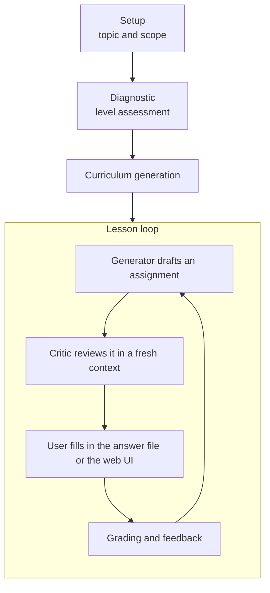

# study-loop (work in progress)

日本語版はこちら → [README.ja.md](README.ja.md)

> **⚠️ Not released.** This plugin lives under `dev/` on purpose: it is excluded from the marketplace, `/plugin install study-loop@agent-plugins` does not work, and commands, file formats, and behavior may change without notice. Everything below describes the current development snapshot.

## Why

Ask an AI to teach you something and it hands you a wall of explanation — which feels like learning and mostly isn't. The research is clear that what makes knowledge stick is the opposite of passive reading: being tested, retrieving from memory, spacing, and feedback. study-loop restructures "I want to study X" into that shape: level diagnosis → an assignment file → the user writes an answer → grading → feedback → the next assignment. Topic-agnostic — programming, languages, math, history, exam prep, anything.

## How it works



Session state lives as plain Markdown under `.study/<topic-slug>/`: a progress dashboard, the curriculum, a glossary, feedback rules, and an insights log.

## Design decisions

- **Every design decision cites a meta-analysis or systematic review**, documented with effect sizes and sources in `skills/study-loop/references/learning-science.md`: feedback quality (Hattie & Timperley, *d* ≈ 0.70–1.00), retrieval practice / the testing effect (Roediger & Karpicke, *d* ≈ 0.50–0.80), the self-explanation effect (Bisra et al., *g* ≈ 0.55), worked-examples fading (Sweller / Kalyuga, *d* ≈ 0.5–1.0), distributed practice (Cepeda et al., *d* ≈ 0.4–0.9), interleaved practice (Brunmair & Richter, *g* ≈ 0.42), and elaborative interrogation (Dunlosky et al., *d* ≈ 0.42).
- **The author of an assignment never reviews it.** Assignments are drafted by a Generator prompt and checked by a separate Critic pass in a fresh context before the user sees them — catching issues like answers leaked in comments.
- **Session state is Markdown, not a database.** Everything the loop knows lives in readable, versionable files under `.study/`, so progress is inspectable, editable, and not locked to any one agent.
- **The web UI is optional and self-contained.** `/study-ui` starts a local Flask server (`skills/study-loop/scripts/server.py`) bound to loopback only, for reading lessons and filling in answers in the browser; `/study-ui-stop` shuts it down. The server never references `CLAUDE_PLUGIN_ROOT` or any Claude Code environment variable, so it also runs standalone (below).
- **Codex is launched only on demand.** Grading can run through a local Codex App Server session, started as a subprocess only when a job needs it; without `codex login`, the UI falls back to the Markdown-only manual flow.

> **Note**: study-loop's skill instructions (`SKILL.md`) are currently written in Japanese, so the agent runs the loop most naturally in Japanese.

## Trying it from a clone

Load it into a Claude Code session without installing:

```bash
claude --plugin-dir ./dev/study-loop
```

## Running the Web UI standalone (without Claude Code)

From the repository root:

```bash
bash dev/study-loop/skills/study-loop/scripts/start.sh
```

On first run, `start.sh` calls `bootstrap.sh`, which creates a `.venv` next to the scripts and installs `flask`, `markdown`, and `pymdown-extensions` into it — no manual setup step needed.

`--backend` controls how the UI treats Codex (default `auto`):

- `auto` (default) — Codex is only started when you explicitly pick a start action in the UI (e.g. starting the diagnostic, grading an answer); loading the page or saving Markdown never launches it.
- `codex` — in the current implementation this behaves the same as `auto`.
- `manual` — Codex is never used. All grading goes through the Markdown-only manual flow (edit the answer file, then have Claude Code or another agent grade it).

If you plan to use Codex, the only prerequisite is having run `codex login` once beforehand. When a job needs Codex, `codex_app_server.py` starts `codex app-server --stdio` itself as a subprocess and checks authentication on connect; if you haven't logged in, the UI tells you so and falls back to the manual flow.

Other flags:

- `--port <n>` — Fixed port. Without it, `start.sh` searches ports 8765 through 8774 for a free one; with it, the script does not shift to another port on conflict.
- `--root <path>` — Path to the Study Loop session directory (default: `$PWD/.study`).
- `--host <addr>` — Bind address (default `127.0.0.1`). Only loopback addresses (`127.0.0.1`, `localhost`, `::1`) are accepted.
- `--no-open` — Don't automatically open a browser after starting (default: it opens one via `open`/`xdg-open`).

Stop the server with:

```bash
bash dev/study-loop/skills/study-loop/scripts/stop.sh
```
