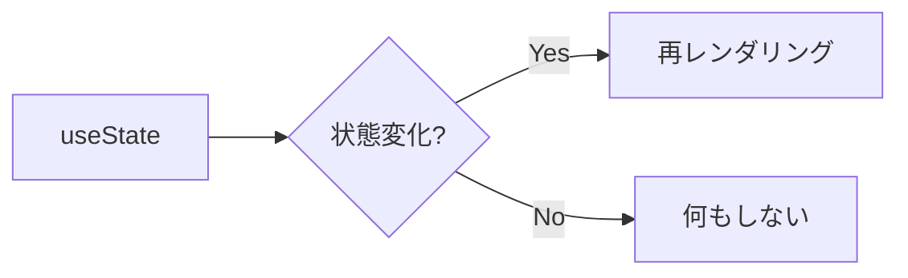

# Explanation Guide: 解説の書き方

採点後の解説は学習効果の **核心** である（Hattie 系メタ分析で *d* ≈ 0.7-1.0、最大級の効果サイズ）。同じ採点でも解説の質で学習成果は劇的に変わる。

このファイルは Study Loop が解説を書くときの規範。**例え話・アナロジー** を必須化し、Self-Explanation Effect / Cognitive Load / Dual Coding を実装する。

## 解説の3つの責務（Feed-up / back / forward）

Hattie & Timperley (2007) の3層構造を踏まえ、解説は必ず以下を満たす:

1. **Feed-up（目標）**: この問題が問うていた本質は何か（1行）
2. **Feed-back（差分）**: ユーザーの回答と模範解答の差はどこか、なぜ間違えたか
3. **Feed-forward（次の一手）**: 同じ間違いを避けるための具体的なヒューリスティック

```markdown
## 解説

**この問題のねらい**: <Feed-up: 1行>

**差分の説明**:
<Feed-back: ユーザーの回答のどこが惜しい / 違うか、なぜ>

**次に意識してほしいこと**:
<Feed-forward: 次回同じ概念に出会った時の指針>
```

模範回答は別セクション `## 模範回答` に `<details>` で書く（生成時に作問 Agent が用意済み。採点時は内容が正しいか確認し、必要なら直す）:

```markdown
## 模範回答

<details><summary>模範回答を展開して見る</summary>
（模範解答コード or 文章）
</details>
```

### 課題ごとに分ける（複数 Part のとき）

課題本文に `### Part A` / `### Part B` … と複数の課題がある場合は、`## 解説` と `## 模範回答` も **本文と同じ `### Part X` 見出しで区切る**。Web UI がこの見出しを手がかりに、各課題の解答欄の直下へ解説・模範回答を表示する（解答欄と同じ並びになる）。

```markdown
## 解説

### Part A

**この問題のねらい**: …
**差分の説明**: …
**次に意識してほしいこと**: …

### Part B

…

## 模範回答

### Part A

<details><summary>模範回答を展開して見る</summary>
…
</details>

### Part B

<details><summary>模範回答を展開して見る</summary>
…
</details>
```

- ラベルは本文と揃える（`### Part A`。コロン以降の説明は無視されるので `### Part A: Faded Example` でも一致する）。
- `### Part` が1つも無い単一問題（診断問題など）は見出し不要 — 直下に普通に書けば唯一の課題に紐付く。
- 各 Part に固有でない全体総評は `## 採点` に書く（全体スコアと一緒にまとまる）。

## 必須: 例え話・アナロジーの埋込み

抽象概念は **必ず1つはアナロジー** を添える。ユーザーの既知領域に橋を渡す。

### アナロジーの作り方（4ステップ）

1. **ターゲット概念の構造を抽出**: 要素 (entities) と関係 (relations) を取り出す
2. **ユーザーの既知ドメインから類似構造を選ぶ**: 日常生活、料理、交通、スポーツなど
3. **1対1対応を明示**: 「X は Y にあたる、A は B にあたる」
4. **アナロジーの限界を添える**: どこまで通用するか、ズレる部分

### 例（プログラミング）

#### TypeScript Generics

> Generic は「型のテンプレート」です。たとえばカレーライスのレシピを思い浮かべてください。
> 「肉と野菜を炒めて煮る」というレシピがあって、**肉と野菜の具体は後で決められる**ようになっている。
> 鶏肉でも牛肉でも豚肉でも同じレシピで作れます。
>
> | レシピ | TypeScript Generic |
> |---|---|
> | 「肉と野菜を煮る」 | `function box<T>(item: T)` |
> | 鶏肉を入れたカレー | `box<string>("hello")` |
> | 牛肉を入れたカレー | `box<number>(42)` |
>
> ただしアナロジーが崩れるところ: レシピは「肉なら何でも」と緩いですが、TypeScript の型は **コンパイル時に厳格にチェック** されます。`number` を渡したのに `string` として使おうとすると怒られます。

#### async / await

> async 関数は「カフェのオーダー番号システム」です。
> コーヒーを注文すると、番号札を渡されて席に戻ります（=`Promise` を受け取る）。
> 出来上がったら呼ばれて取りに行きます（=`await` で待つ）。
> 番号札を持っている間、店員さんは他のお客さんの注文も受けられます（=ノンブロッキング）。

### 例（数学）

#### 微分

> 微分は「車のスピードメーター」です。
> 走行距離（位置）の **瞬間的な変化率** を測っているのが速度。
> 速度の瞬間的な変化率を測ったら加速度。これが2階微分。

### アナロジーが思いつかないとき

無理に作ると誤解を生む。代わりに:
- **ステップ展開で見せる**（worked example として）
- **対比で見せる**（「これと似ているがこう違う」）
- **失敗例を見せる**（「こう書くとこういう問題が起きる」）

## Self-Explanation を引き出す

Bisra et al. (2018, *g* = 0.55) のとおり、**用意された解説を読ませる** より **自分で説明させる** 方が学習効果が高い。

### 採点フローへの組込み

1. ユーザーが回答を書いた
2. ⏸ **解説を出す前に質問する**: 「採点する前に、この答えに至った理由を一言で説明できますか？（思いつかなければ『パス』でOK）」
3. ユーザーの説明を受ける
4. 採点 + 模範解説を提示
5. **ユーザーの説明と模範解説の差分** を明示する: 「ユーザーは X と捉えていましたが、本質は Y です」

ただし Stage 1（完全初学者）では prior knowledge が不足するため、self-explanation はスキップして worked example 中心にする（Elaborative Interrogation の限界と同じ理由）。

### Stage 別の挟み方

| Stage | Self-Explanation | 例文 |
|---|---|---|
| 1 (Foundation) | ⚠️ スキップ可 | （直接 worked example を見せる） |
| 2 (Practical) | ◎ 必須 | 「採点前に、なぜこう書いたか教えてください」 |
| 3 (Design) | ◎ 必須 + 拡張 | 「他にどんな選択肢があり、なぜこれを選んだか？」 |

## Dual Coding: 言語 + ビジュアル

Mayer の Multimedia Learning theory に基づき、複雑な概念は **テキストだけでなく図** を添える。md なので ASCII 図 / Mermaid / 表を活用。

### 使える形式

#### 構造図（ASCII）

```
┌─────────┐    Promise<User>     ┌─────────┐
│ Client  │ ────────────────────▶ │ Server  │
└─────────┘ ◀──────────────────── └─────────┘
              .then(user => ...)
```

#### Mermaid（クロード Code が描画してくれる）

````markdown

````

#### 比較表

```markdown
| | let | const | var |
|---|---|---|---|
| スコープ | block | block | function |
| 再代入 | ✅ | ❌ | ✅ |
| 巻き上げ | TDZ | TDZ | undefined |
```

#### ステップ展開（worked example）

```markdown
1. まず引数を check する → `if (!input) throw ...`
2. 次に正規化する        → `const trimmed = input.trim()`
3. 最後に変換する        → `return trimmed.toLowerCase()`
```

ただし図を入れすぎると **Cognitive Load** が増えて逆効果。**1解説 1-2図** が目安。

## 「わからない」「空欄」回答への対応（必須プロトコル）

ユーザーの回答が以下の場合、**必ず以下を実行する**（次に進まない）:

- 回答欄が空欄
- 「わかりません」「わからない」「？」「skip」と書かれている
- 明らかに当てずっぽう（質問と無関係）

### プロトコル

1. **責めない、否定しない** — 「わからない」は学習機会の入口
2. **段階的に支援を提供**:
   - まず **アナロジー** で概念のイメージを伝える
   - 次に **ヒント1（誘導）** を出してもう一度試してもらうか聞く
   - ユーザーが「答えを教えて」と言うか、再挑戦に応じない場合は **完全な模範回答 + 解説** を提示
3. **スコアは 0.1-0.3** を付ける（0 ではなく、取り組んだ姿勢を最低評価）
4. **Weak タグに登録** + そのトピックを **次の lesson でもう一段階基礎レベルから** 出題するようカリキュラムを調整
5. **「同じ概念を別バリエーションで再出題」** を curriculum の Spaced Reviews に追加

### 提示文の例

```
[わからない] と書いていただきありがとうございます。それは大事なシグナルです。

まずイメージから:
（アナロジーをここに）

これでもまだピンと来ませんか？
- 「ヒントが欲しい」 → 段階ヒントを出します
- 「答えと解説を見たい」 → すぐに模範回答を出します
- 「もう一度挑戦したい」 → 別のバリエーションで出題します
```

## 解説の長さ

Cognitive Load を抑えるため、解説本体は **1問あたり 8-15行** が目安。例え話で長くなる場合は `<details>` で折りたたむ。

```markdown
## 解説

**この問題のねらい**: ...
**差分の説明**: ...
**次に意識してほしいこと**: ...

<details><summary>📚 詳しい背景・例え話（クリックで展開）</summary>
...
</details>

<details><summary>✅ 模範回答</summary>
...
</details>
```

## アンチパターン（避ける）

- **「すばらしいです！」「がんばりました！」だけのフィードバック** — 中身ない praise は *d* < 0.20（Hattie 2020）
- **正解 / 不正解だけの解説** — 学習機会を捨てている
- **長文の講義口調** — 認知負荷オーバー。要点を絞る
- **「公式ドキュメントを読んでください」のような丸投げ** — 解説責任の放棄
- **アナロジーが概念とズレている** — 誤概念の固定化を生む。ズレる部分は明示する
- **「わからない」をスコア 0 で次に進む** — **絶対禁止**。学習が成立しない
- **同じアナロジーの使い回し** — 既知ドメインが噛み合わないとアナロジーは逆に難しくする。複数候補からユーザーに合いそうなものを選ぶ

## チェックリスト（解説を書き終えたら自問する）

- [ ] Feed-up / Feed-back / Feed-forward の3層が揃っているか
- [ ] 例え話・アナロジー or ステップ展開 or 構造図のいずれかが入っているか
- [ ] ユーザーの **回答に固有の差分** に触れているか（汎用的な解説で済ませていないか）
- [ ] アナロジーが破綻している部分を明示しているか
- [ ] 「わからない」回答だった場合、模範回答を必ず提示したか
- [ ] 賞賛の言葉が中身を伴っているか（具体的に何が良かったか）
