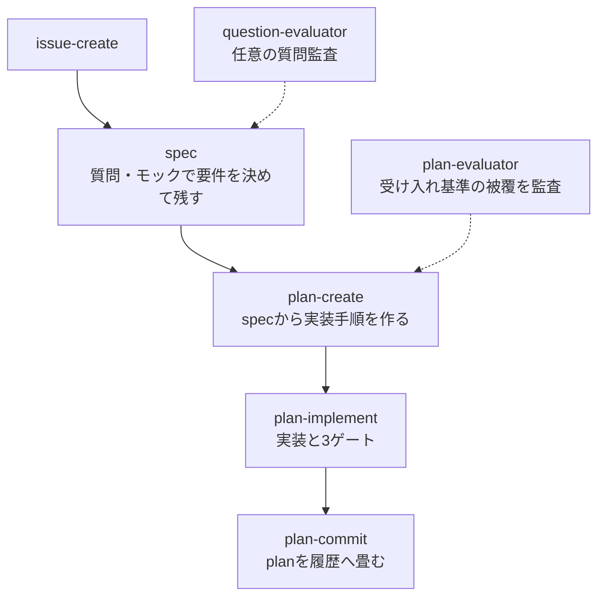

# crystallize-codex

Claude Code版 [`../crystallize`](../crystallize) を振る舞いの正本 (SSoT) として、Codex向けに派生させた plan 駆動開発プラグインです。v0.4.0 のプロジェクト共通用語集、改訂された決裁カード、spec / plan 分離、分割 plan、モック・レポートキット、昇格 0 件の diff-review を含みます。

仕様決め、plan作成、TDD実装、機械検証、ユーザーによる挙動確認、危険箇所だけのリスク決裁、planをコミット履歴へ畳み込むところまでを一続きで扱います。

## SSoTと同期

- `../crystallize/skills/` が振る舞いの正本です
- `overrides/` はCodexのサブエージェント、入力、表示、承認への最小差分です
- `skills/` は正本とoverridesから再生成する配布物で、手編集を正本にはしません
- Claude版の追加・削除・変更を検出すると同期チェックが失敗します

```bash
python3 scripts/capture_overlays.py --source ../crystallize
python3 scripts/sync_from_claude.py --write
python3 scripts/sync_from_claude.py --check
```

正本が隣接していない検証環境では、各コマンドに `--source /absolute/path/to/crystallize` を指定できます。

## Codex向けの実行差分

- Claude版の fork 境界は、履歴を渡さないCodexサブエージェントに置き換えます
- Claudeの引数展開は起動メッセージ、または親から渡す明示的な input envelope に置き換えます
- Claudeのスキル呼び出しは、対象SKILLの絶対パスを指定した子、または同一コンテキスト実行に置き換えます
- 質問はCodexの構造化質問機能を優先し、使えない場合も前提・推奨・各選択肢の得失を含む全文を表示します
- `plan-implement` はフェーズ1で公式 `review-agent` の解決済みrealpathを保持し、フェーズ3で同じ絶対パスだけを使います。レビュー子は `gpt-5.6-sol` / `high` / 履歴なしで起動します
- evaluatorとgeneratorは独立した履歴なしの子で実行し、利用できない場合は同一コンテキストへ黙ってフォールバックしません
- HTMLとモックはローカルに生成し、Codex内のファイル表示またはブラウザプレビューで確認します

サブエージェントの起動時は、実装・変更系を `gpt-5.6-luna` / `max`、評価・レビュー系を `gpt-5.6-sol` / `high` として明示します。

## フロー



`spec` は残る要件文書で、改訂履歴とテストケース表を持ちます。`plan` は使い捨ての実装手順で、specが大きいときは、触るモジュールが重ならず単体で確認できる単位へ分割します。分割 plan は担当するACを `covers:` に、先行成果物への依存を `depends-on:` に記録します。

モックは論点に応じて1案 + 調整パネル、2案、最大3案を使い分け、`spec/assets/mock-kit.html` の共通部品を使います。レポートは `html-report` の固定構成と図解カタログを使います。diff-review は昇格 hunk が0件ならHTMLを作らず、検算結果を1行で返します。

## スキル

| スキル | 内容 |
|---|---|
| `issue-create` | 会話のバグ・思いつき・雑務をGitHub issueとして起票する |
| `spec` | 質問とモックで要件を決め、決まった語をプロジェクト共通の用語集（`docs/crystallize/CONTEXT.md`）に書き足しながら、要件・非機能要件・受け入れ基準をspecに書く。既存specは改訂する |
| `question-evaluator` | `spec` の質問を任意の独立コンテキストで監査する |
| `plan-create` | specから実装計画を作り、必要なら `covers:` / `depends-on:` 付きで分割する |
| `plan-evaluator` | planがspecの受け入れ基準を全て覆うか監査する |
| `plan-implement` | 実装、機械ゲート、挙動ゲート、例外ゲートを駆動する |
| `test-generator` | specのテストケース表から失敗するテストだけを書く |
| `code-generator` | スライスを実装してテストをGREENにする |
| `html-report` | 長い報告を自己完結HTMLにしてCodex内で表示する |
| `diff-review` | 危険箇所だけを決裁カードで示し、昇格0件なら短縮する |
| `plan-commit` | plan本文とspec改訂行をコミットメッセージへ畳み、planを削除する |
| `tdd` | 残す価値のあるテストを書くためのred → greenリファレンス |
 
## 保存先

- `docs/crystallize/specs/` — spec本体と台帳・モック。残る成果物
- `docs/crystallize/plans/` — plan本体と作業ファイル。コミット時に削除される
- `docs/crystallize/reports/` — HTMLレポート
- `docs/crystallize/CONTEXT.md` — プロジェクト共通の用語集。リポジトリ直下に `CONTEXT.md` があり `## 用語` または `## Language` の見出しを持つ場合は、そちらを正本として使う

## 検証

```bash
python3 scripts/sync_from_claude.py --check
python3 scripts/validate_port.py
python3 /path/to/skill-creator/scripts/quick_validate.py skills/<skill>
python3 /path/to/plugin-creator/scripts/validate_plugin.py .
```

代表的な起動例:

```text
$crystallize-codex:spec この実装依頼の認識を合わせてspecを作ってください
$crystallize-codex:plan-create docs/crystallize/specs/<slug>.md
$crystallize-codex:plan-implement /absolute/path/to/docs/crystallize/plans/<slug>.md
```
