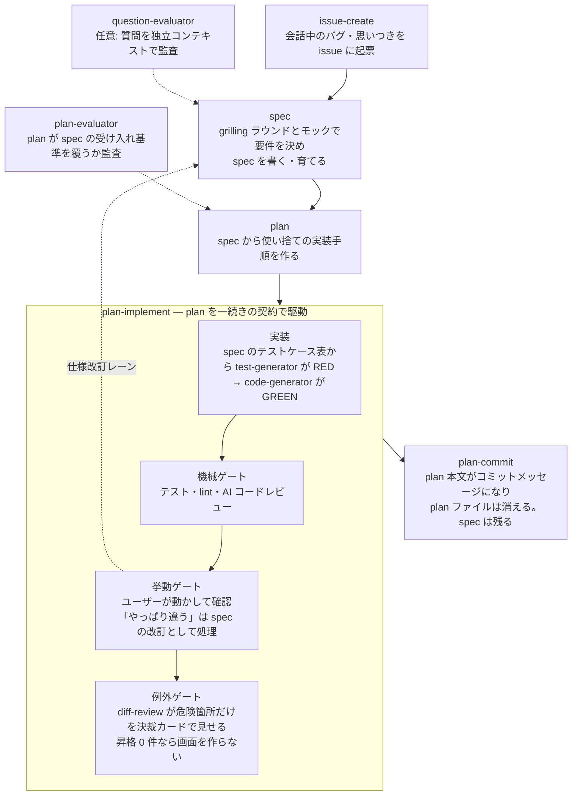

# crystallize

仕様決め → 実装 → 検証 → コミットを1本のフローとして進める Claude Code プラグインです。実装に入る前にユーザーへの質疑で要件を spec（残す文書）にまとめ、spec から plan（使い捨ての実装手順）を作り、実装後は「テスト・lint・AI レビュー」「ユーザー自身の動作確認」「危険箇所に絞ったリスク決裁」の3段階で検証し、最後は plan の内容をそのままコミットメッセージにしてコミットします。

要件は固定するものではなく育てるものとして扱います。認識合わせでどれだけ詰めても、UI は触って初めて分かることが残り、リリース後に利用者の声で変わることも普通にあります。忠実性とは『黙って逸れないこと』であって『変えないこと』ではない、という前提でフロー全体を組んでいます。

## なぜ作ったか

AI エージェントとの開発では、仕様は対話の中で決まっていきます。ところが会話は流れるので、決めたことがコンテキストの彼方に揮発し、曖昧さが残ったまま実装が走り出します。そして出てきた大量の diff を前に、レビューは「全部読む」しかなくなって破綻する——自分の開発で繰り返し起きた失敗です。

crystallize はこれを3つの手で潰します。**実装の前に**、決めた要件を spec に、実装手順を plan に書き固めてから実装に渡す。**実装の後は**、検証を「テスト・lint・AI レビュー → ユーザーの動作確認 → 危険箇所だけのリスク決裁」の3段階に分け、人間が判断する量を危険箇所だけに絞る。**最後に**、plan 本文をそのままコミットメッセージにして、決定の記録を git 履歴に残す。

なお、この3段階の検証をプラグイン内では「機械ゲート・挙動ゲート・例外ゲート」と呼んでいます（以下の図・表でもこの名前が出てきます）。

## 全体像



## スキル一覧

| スキル | 内容 |
|---|---|
| `issue-create` | 会話で出たバグ・思いつき・雑務を GitHub issue として起票する。リポジトリ既存のテンプレ・ラベル運用に従い、何も設置しない |
| `spec` | 実装に入る前の認識合わせ。前提が解決済みの質問をラウンド一括で出し（推奨回答つき）、見て反応できる成果物（モック、または API レスポンス例などの代替物）で確定を取り、要件・非機能要件・受け入れ基準（テストケース表）を spec に書く。決まった語はその場でプロジェクト共通の用語集（`docs/crystallize/CONTEXT.md`）に書き足して育てる。既存 spec を渡せば改訂モードで育てる |
| `question-evaluator` | `spec` がユーザーに出す質問の前提・二択の正当性を、出題側とは別コンテキストで監査する。既定では呼ばれず、`audit: on` かユーザーの指示で任意に使う |
| `plan` | spec を受けて既存挙動への影響を裏取りし、変わりやすい順の実装計画を plan に書く。spec が大きければ、触るモジュールが重ならず単体で挙動確認できる単位で複数の plan に分ける（1 plan = 1 まとまりのコミット） |
| `plan-evaluator` | `plan` が書き出した plan が spec の受け入れ基準を全て覆っているか・前提が裏取りされているかを、作成側とは別コンテキストで監査する |
| `plan-implement` | plan と spec を受け取り、実装 → 機械ゲート → 挙動ゲート → 例外ゲート → コミットまでを一続きで駆動する。挙動ゲートでの「やっぱり違う」は spec の改訂として処理する |
| `test-generator` | spec のテストケース表から、実装前に失敗するテスト（RED）だけを書く |
| `code-generator` | スライスを実装して GREEN にする。レビュー指摘の修正でも使う |
| `diff-review` | 動作確認が収束したあとの差分から、危険な箇所だけを決裁カード（何が起きうるか・戻せるか・影響範囲・AI レビューの判定）で人間に見せる。昇格 0 件なら画面を作らず 1 行で go を取る |
| `html-report` | 30行を超える散文の報告を、要点先行・インライン SVG 図解の自己完結 HTML レポートに整形して開く（`diff-review` の派生元） |
| `plan-commit` | plan の内容をそのままコミットメッセージにしてコミットし、plan ファイルを削除する。spec の改訂行があれば転記する |
| `tdd` | red → green のループから残す価値のあるテストを書くためのリファレンス |

## 設計上の判断

- **spec は残し、plan は消す** — 要件（spec）と実装手順（plan）は寿命が違います。要件は実装して触ってから、あるいはリリース後に変わるものなので、戻って書き換えられる実体として `docs/crystallize/specs/` に残し、改訂履歴で育てます。文書とコードの乖離は、spec の改訂モードが冒頭で既存 spec とコードの矛盾を必ず突き合わせることで抑えます。一方 plan は実装が終われば役目を終えるので、ファイルとしては消してコミット履歴を恒久保存先にします。過去の記録を本当に読み返すのは「このバグはいつ混入したか」を追うときで、そのとき必要なのは記述と差分の対応です。コミットメッセージに畳み込んであれば、`git log` で該当の記述を見つけて、そのコミットの diff を開くだけで原因のコードに届きます。
- **用語の正本はプロジェクトに 1 ファイルだけ置く** — 語の定義を spec ごとの「用語」節に置くと、spec が増えるほど同じ語の定義が分散して揺れ、認識合わせの冒頭で全部を読み比べる手順が重くなります。そこで用語集を `docs/crystallize/CONTEXT.md` の 1 ファイルに集約し、`spec` が語を決めた瞬間にそこへ書き足します（書き手は `spec` だけ。例外は挙動ゲートで要件の語が変わったときの `plan-implement` で、あの場面は spec の編集者として動いています）。spec 側の「用語」節は正本ではなく「この spec で決めた語・変えた語」の記録に変わり、plan・実装・レポートは用語集の語を使います。用語集には**語の定義だけ**を書き、決定の経緯（ADR に相当するもの）は入れません — 決定の記録は plan がコミットメッセージに、要件の変更は spec の改訂履歴に残るので、三つ目の置き場を作ると、どれが最新かを読む側が判断できなくなります（[mattpocock/skills](https://github.com/mattpocock/skills) の domain-modeling を参考にしました）。
- **質問はラウンド一括、事実は聞かない** — 前提が解決済みの質問だけをまとめて出し、各質問に推奨回答を添えます。まだ開いている質問に依存する質問は次のラウンドに回るので、一問ずつ聞かなくても前の答えが次の質問に反映されます。コードベースや API 仕様で決まる事実はエージェントが調べ、ユーザーには好みと優先順位だけを聞きます（[mattpocock/skills](https://github.com/mattpocock/skills) の grilling を参考にしました）。
- **仕様変更の出所で扱いを分ける** — 実装中にエージェントが要件との矛盾に気づいたら止めてユーザーに戻します。挙動ゲートでユーザー自身が「やっぱりこうしたい」と言ったら、それは手戻りではなく spec の改訂です。一度「spec に記録します」と宣言して要件・受け入れ基準・テストを差し替え、同じ点で聞き直しません。
- **plan の分割は spec ではなく plan の関心事** — spec は「何を作るか」の文書なので要件のまとまりとして 1 つに保ち、「どこまでを一度に実装して 1 コミットにするか」は plan が決めます。触るモジュールが重ならない・その部分だけで挙動確認できる・分ける価値がある大きさ、の 3 条件を満たすときだけ分け、各 plan は担当する受け入れ基準の ID を `covers:` に書き、先行 plan があるときだけ `depends-on:` でそれを指します。plan-evaluator は plan 群の和集合が spec の受け入れ基準を全て覆うかを検算します。
- **モックの案数は論点で決める** — 値や程度の論点なら 1 案と調整パネル、構造の論点が 1 つなら 2 案、方向性が未定のときだけ 3 案（上限）です。案は 1 つの HTML 内で切り替え、端末フレーム・並べ方・切替バーはモックキットとして正本を固定しています（[mattpocock/skills](https://github.com/mattpocock/skills) の prototype を参考にしました）。
- **例外ゲートでの人間の役目はリスク受容の決裁** — 正しさはテストと AI レビューが担保済みなので、人間にコードの正しさを判定させません。昇格した箇所は「何が起きうるか・元に戻せるか・影響範囲・AI レビューの判定」の平文で示し、コードは畳みます。昇格が 0 件なら画面を作らず、検算の数字を添えた 1 行で go を取ります。
- **挙動ゲートが収束するまで diff-review を作らない** — 修正ループの途中で diff を見せると、直すたびに陳腐化して結局読まれないままコミットに流れます（実際に繰り返し観測された失敗パターン）。レビューは差分が固まった最後に1回だけ出します。
- **レポートとモックは部品の正本を固定する** — 散文の指示だけでは生成のたびに見た目が揺れるので、レポートは固定構成（要点 → 用語 → 本論 → 詳細 → 根拠）とインライン SVG の図解カタログ 5 種、モックは切替バー・端末フレーム・調整パネルを、そのまま埋め込む HTML/CSS の実体として同梱しています（[mathbullet/skills](https://github.com/mathbullet/skills) の html と [humanlayer/skills](https://github.com/humanlayer/skills) の show-me を参考にしました）。
- **サブエージェントの完了報告を証拠として扱わない** — 「テスト通りました」という自己申告と、テストが通っている事実は別物です。機械ゲートでは、統括役がテスト・lint コマンドを自分で実行し直します。
- **書いた本人に採点させない** — RED を書く `test-generator`、GREEN にする `code-generator`、質問を監査する `question-evaluator`、plan を監査する `plan-evaluator` はそれぞれ別コンテキストで動きます。特に2つの evaluator は、出題・作成側の作業ファイルを**渡されても読まない**（案を見た監査者は同じバイアスに迎合するため）・評価基準を書き換えられない（Read のみ）という制約つきです。`plan-evaluator` だけは spec を読みます（plan が spec の受け入れ基準を覆っているかを検査するため）。
- **質問監査は任意にし、効果を数字で見る** — 全質問を fork で監査していた v0.2 までの運用は、効果を測る記録がなく、費用対効果を判断できませんでした。v0.3 では質問の書式に「前提・推奨・各選択肢で失われる挙動」を構造として持たせ、監査は任意にしたうえで、質問数・監査数・不合格数を spec の作業ファイルに残します。数字がたまってから存廃を決めます。
- **plan 監査に2回連続で落ちたら作り直しをやめてユーザーに戻す** — `plan-evaluator` に 2 回連続で不合格になったら、3 稿目を書き始めません。監査スコアと不合格の具体的理由を提示し、「前提かゴール自体が間違っていないか」をユーザーに直接問います。連続不合格は文面の磨き込み不足ではなく前提側の誤りのシグナルとして扱います。
- **エージェント発の逸脱は記録して進むか、止まるか** — plan と食い違う発見があったとき、可逆で局所的な選択だけ Deviations ログに書いて進み、要件と矛盾する変更は止めてユーザーに戻します。迷ったら止まる側に倒します（ユーザー発の変更は上記のとおり spec の改訂として扱います）。
- **リファクタリングと機能変更を混ぜない** — plan-commit がコミット直前の最終チェックとして働き、両方を含む差分は分割コミットにします。

## 成果物の保存先

- `docs/crystallize/specs/` — `spec` が作る spec と作業ファイル（論点台帳・モック）。残る文書で、改訂履歴とともに育てます
- `docs/crystallize/plans/` — `plan` が作る plan と作業ファイル。`plan-commit` でコミットメッセージに畳み込まれると同時に削除されるため、リポジトリには一時的にしか存在しません
- `docs/crystallize/reports/` — `html-report` / `diff-review` が生成する HTML レポート
- `docs/crystallize/CONTEXT.md` — プロジェクト共通の用語集。`spec` が最初の語を決めた時点で作られ、以降は語が決まるたびに書き足されます。リポジトリ直下に `CONTEXT.md` があって `## 用語` または `## Language` の見出しを持つ場合は、そちらを正本として使い、この位置には作りません（既に同じ役割のファイルを置いている運用と用語集を二重化させないため）

## インストール

```
/plugin marketplace add 4armsxlr8/agent-plugins
/plugin install crystallize@agent-plugins
```

ローカルでの開発・検証:

```bash
claude --plugin-dir ./plugins/crystallize
```

### Codex での対応状況（実測）

`codex plugin marketplace add 4armsxlr8/agent-plugins` → `codex plugin add crystallize@agent-plugins` でインストール自体は通ります（Codex CLI 0.144 で確認）。ただし各スキルは、サブエージェントへの実装委任・fork コンテキストでの監査など **Claude Code の実行基盤を前提にした手順**を含むため、現状は Claude Code 向けです。Codex ではフローの知識として読み込まれる範囲の利用にとどまり、動作保証はありません。

## 参考にした設計

フローの骨格 — plan を `plans/` に作る → 実装 → レビュー用画面で確認 → plan の内容をそのままコミットメッセージにしてコミットし、plan ファイルを消す — は、[catnose さん（@catnose99）のこのポスト](https://x.com/catnose99/status/2080568062563201436)で紹介されていた開発の進め方が元です。これを参考に自作していた仕組みを、プラグインとして改造しました。

v0.3 の認識合わせ（ラウンド一括の質問・推奨回答・事実と決定の分離）は [mattpocock/skills](https://github.com/mattpocock/skills) の grilling と domain-modeling、spec の形式は同 to-spec、モックの切替と案数の考え方は同 prototype を参考にしました。レポートの固定構成・色と表の規則・インライン SVG 図解は [mathbullet/skills](https://github.com/mathbullet/skills) の html、「見せたいもの → 図の型」の対応と「図は支える文の隣に置く」規則は [humanlayer/skills](https://github.com/humanlayer/skills) の show-me を参考にしました。

## tdd スキルの出所

`skills/tdd/` は [mattpocock/skills](https://github.com/mattpocock/skills)（MIT License）の [tdd スキル](https://github.com/mattpocock/skills/tree/main/skills/engineering/tdd)をフォークし、日本語化・改造したものです。
