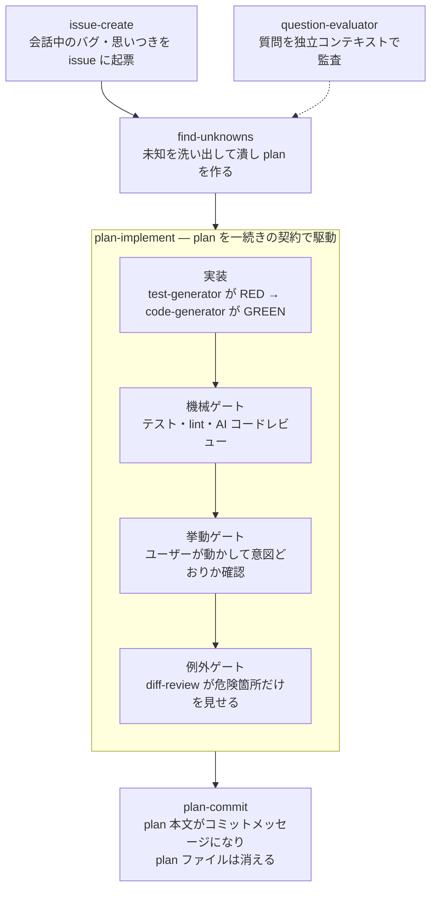

# crystallize

仕様決め → 実装 → 検証 → コミットを1本のフローとして進める Claude Code プラグインです。実装に入る前にユーザーへの質疑で仕様の曖昧さを潰して plan ファイル（Markdown）にまとめ、実装後は「テスト・lint・AI レビュー」「ユーザー自身の動作確認」「危険箇所に絞った差分レビュー」の3段階で検証し、最後は plan の内容をそのままコミットメッセージにしてコミットします。

## なぜ作ったか

AI エージェントとの開発では、仕様は対話の中で決まっていきます。ところが会話は流れるので、決めたことがコンテキストの彼方に揮発し、曖昧さが残ったまま実装が走り出します。そして出てきた大量の diff を前に、レビューは「全部読む」しかなくなって破綻する——自分の開発で繰り返し起きた失敗です。

crystallize はこれを3つの手で潰します。**実装の前に**、決めた仕様を plan ファイルに書き固めてから実装に渡す。**実装の後は**、検証を「テスト・lint・AI レビュー → ユーザーの動作確認 → 危険箇所だけの差分レビュー」の3段階に分け、人間が読む量を危険箇所だけに絞る。**最後に**、plan 本文をそのままコミットメッセージにして、決定の記録を git 履歴に残す。

なお、この3段階の検証をプラグイン内では「機械ゲート・挙動ゲート・例外ゲート」と呼んでいます（以下の図・表でもこの名前が出てきます）。

## 全体像



## スキル一覧

| スキル | 内容 |
|---|---|
| `issue-create` | 会話で出たバグ・思いつき・雑務を GitHub issue として起票する。リポジトリ既存のテンプレ・ラベル運用に従い、何も設置しない |
| `find-unknowns` | 実装に入る前の認識合わせ。unknowns を洗い出して潰し、plan を1枚作る |
| `question-evaluator` | `find-unknowns` がユーザーに出す質問の前提・二択の正当性を、出題側とは別コンテキストで監査する |
| `plan-implement` | plan を受け取り、実装 → 機械ゲート → 挙動ゲート → 例外ゲート → コミットまでを一続きで駆動する |
| `test-generator` | TDD 対象スライスの実装前に、失敗するテスト（RED）だけを書く |
| `code-generator` | スライスを実装して GREEN にする。レビュー指摘の修正でも使う |
| `diff-review` | 動作確認が収束したあとの差分から、危険な箇所だけを人間に見せるレビュー画面を作る |
| `html-report` | 30行を超える散文の報告を、自己完結 HTML レポートに整形して開く（`diff-review` の派生元） |
| `plan-commit` | plan の内容をそのままコミットメッセージにしてコミットし、plan ファイルを削除する |
| `tdd` | red → green のループから残す価値のあるテストを書くためのリファレンス |

## 設計上の判断

- **plan はファイルとしては消え、コミット履歴が恒久保存先になる** — 設計文書を残すと、コードと文書の乖離という第二のメンテナンス対象が生まれます。plan をコミットメッセージに畳み込めば、決定の記録は該当コミットに永続し、腐る文書は残りません。
- **挙動ゲートが収束するまで diff-review を作らない** — 修正ループの途中で diff を見せると、直すたびに陳腐化して結局読まれないままコミットに流れます（実際に繰り返し観測された失敗パターン）。レビューは差分が固まった最後に1回だけ出します。
- **サブエージェントの完了報告を証拠として扱わない** — 「テスト通りました」という自己申告と、テストが通っている事実は別物です。機械ゲートでは、統括役がテスト・lint コマンドを自分で実行し直します。
- **書いた本人に採点させない** — RED を書く `test-generator`、GREEN にする `code-generator`、質問を監査する `question-evaluator` はそれぞれ別コンテキストで動きます。特に question-evaluator は、出題側の実装案を**渡されても読まない**（案を見た監査者は同じバイアスに迎合するため）・評価基準を書き換えられない（Read のみ）という制約つきです。
- **逸脱は記録して進むか、止まるか** — plan と食い違う発見があったとき、可逆で局所的な選択だけ Deviations ログに書いて進み、確定事項と矛盾する変更は止めてユーザーに戻します。迷ったら止まる側に倒します。
- **リファクタリングと機能変更を混ぜない** — plan-commit がコミット直前の最終チェックとして働き、両方を含む差分は分割コミットにします。

## 成果物の保存先

- `docs/crystallize/plans/` — `find-unknowns` が作る plan と作業ファイル。`plan-commit` でコミットメッセージに畳み込まれると同時に削除されるため、リポジトリには一時的にしか存在しません
- `docs/crystallize/reports/` — `html-report` / `diff-review` が生成する HTML レポート

## インストール

```
/plugin marketplace add 4armsxlr8/agent-plugins
/plugin install crystallize@agent-plugins
```

ローカルでの開発・検証:

```bash
claude --plugin-dir ./plugins/crystallize
```

### Codex での対応状況（実測）

`codex plugin marketplace add 4armsxlr8/agent-plugins` → `codex plugin add crystallize@agent-plugins` でインストール自体は通ります（Codex CLI 0.144 で確認）。ただし各スキルは、サブエージェントへの実装委任・fork コンテキストでの監査など **Claude Code の実行基盤を前提にした手順**を含むため、現状は Claude Code 向けです。Codex ではフローの知識として読み込まれる範囲の利用にとどまり、動作保証はありません。

## 参考にした設計

フローの骨格 — plan を `plans/` に作る → 実装 → レビュー用画面で確認 → plan の内容をそのままコミットメッセージにしてコミットし、plan ファイルを消す — は、[catnose さん（@catnose99）のこのポスト](https://x.com/catnose99/status/2080568062563201436)で紹介されていた開発の進め方が元です。これを参考に自作していた仕組みを、プラグインとして改造しました。

## tdd スキルの出所

`skills/tdd/` は [mattpocock/skills](https://github.com/mattpocock/skills)（MIT License）の [tdd スキル](https://github.com/mattpocock/skills/tree/main/skills/engineering/tdd)をフォークし、日本語化・改造したものです。
