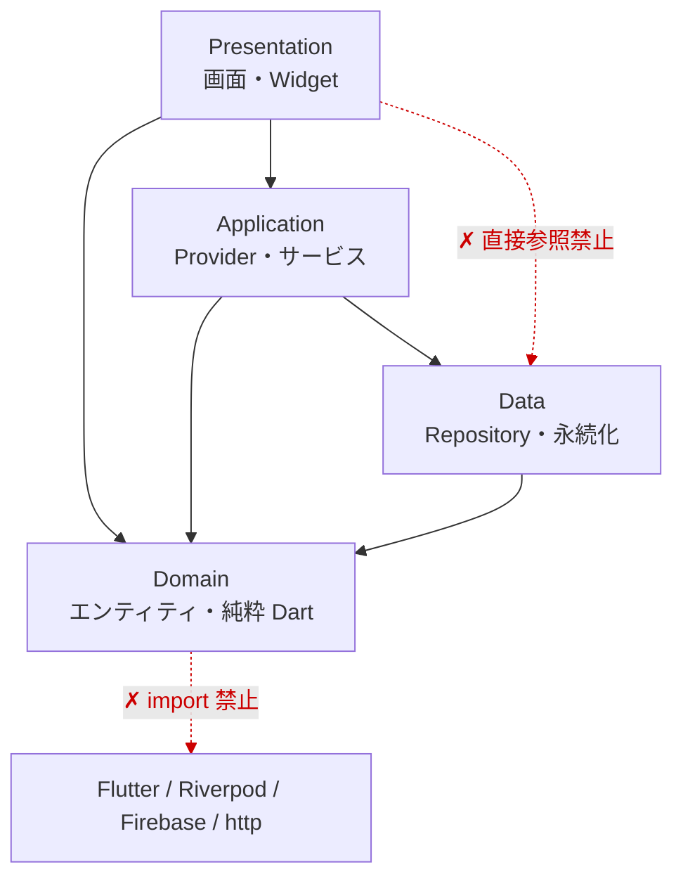
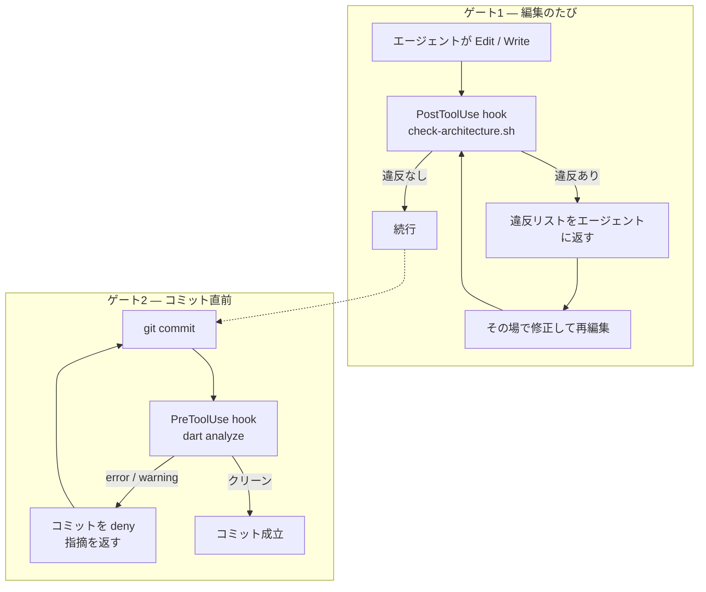

# flutter-riverpod-guardrails

Flutter + Riverpod プロジェクトの Clean Architecture レイヤー分離を、**AI エージェントがコードを書いた直後に**機械検査する Claude Code プラグインです。Codex ではスキル部分が利用できます（対応状況は後述）。

## なぜ作ったか

AI エージェントに実装を任せると、コードが出てくる速度に人間のレビューが追いつきません。アーキテクチャ違反（Domain 層への Flutter 依存の混入、Presentation から Data 層への直接アクセスなど）は、diff の海に紛れると後から見つけるのが難しく、直すのはもっと難しくなります。

そこで「人間が全部読んで違反を探す」のをやめて、**エージェントがファイルを保存した瞬間に機械が検査し、違反があればその場でエージェント自身に直させる**構成にしました。ルールは、公開中の自作 iOS アプリ（アニ100）で使っているアーキテクチャ規約をそのまま検査可能な形に落としたものです。

## 前提とするアーキテクチャ

このプラグインは、**feature-first の4レイヤー構成**（パスに `domain / data / application / presentation` を含むディレクトリ構成）を前提に、次の依存ルールを守らせます。この形を採っている・採ろうとしているプロジェクトが導入対象です。

許可される依存の向きはこの図のとおりで、点線が代表的な違反です。



| レイヤー | 依存してよいもの | 禁止の代表例 |
|---|---|---|
| Domain | なし（純粋 Dart のみ） | flutter / riverpod / firebase / http / dio の import |
| Data | Domain | Flutter・Riverpod の import、`BuildContext`、`kIsWeb` の直接参照（コンストラクタ注入で受ける）、インターフェース分離のための abstract class |
| Application | Domain・Data（`flutter_riverpod` は可） | `package:flutter/` の import、`BuildContext`・`Navigator`・`showDialog`・`ScaffoldMessenger` |
| Presentation | Application・Domain | Data のリポジトリ直接 import、関数型ウィジェット（`build` 以外の `Widget xxx()` 宣言） |

一部は意見の分かれる規約です。たとえば Data 層の abstract class 禁止は、「Dart のクラスは暗黙のインターフェースを持つので、テストでの差し替えは具象クラス + provider override で足りる」という判断で、個人開発の規模では層の薄さを優先しています。

### 参考にした設計

このレイヤー構成と規約は、次の2つをベースに、自作アプリでの運用に合わせて取捨選択したものです。

- mono さん [Flutterアプリにおける、過不足ない設計の考察🎅](https://medium.com/flutter-jp/architecture-240d3c56b597)
- Andrea Bizzotto さん [Flutter App Architecture with Riverpod: An Introduction](https://codewithandrea.com/articles/flutter-app-architecture-riverpod-introduction/) のシリーズ

## どう動くか

検査のゲートは2つあります。編集のたびに走るアーキテクチャ検査と、コミット直前の `dart analyze` です。



<details>
<summary>実際の検出出力を見る（違反を仕込んだサンプルへのスキャン結果）</summary>

```
$ ./scripts/check-architecture.sh --scan demo/lib

Scanning: demo/lib
=========================================

Results: 3 files checked, 4 violations

Violations:
  - [features/home/application/home_service.dart] Application: Navigator use prohibited
  - [features/home/domain/anime.dart] Domain: package:flutter/ import prohibited
  - [features/home/presentation/home_view.dart] Presentation: direct repository import prohibited (use Application providers)
  - [features/home/presentation/home_view.dart:7] Presentation: function-style widget prohibited — extract to a class extending StatelessWidget/StatefulWidget (Widget Classes NOT Functions)
```

</details>

## 設計上の判断

- **編集直後（PostToolUse）に検査する** — コミット後のレビューで見つかった違反は「指摘 → 文脈の復元 → 修正」のコストがかかりますが、書いた直後ならエージェントがその場で直せます。違反を安く潰せる最速のタイミングに検査を置いています。
- **fail-open 原則** — hook の入力がパースできない、`dart` が PATH にない、といった場合は黙って通します。guardrail 自身がセッションを固めてしまうことを、検査漏れより重い障害と位置づけているためです。
- **出力量に上限を設ける** — 違反は最大50件、`dart analyze` の引用は最大10行で打ち切ります。生成ファイル1つで数百件の違反が出ることがあり、全部返すと LLM のコンテキストを圧迫して、かえって修正の精度を落とすためです。
- **error / warning でブロックし、info は素通しする** — 現実の Flutter プロジェクトは info レベルの lint を大量に抱えているため、ブロック条件を severity で切り分けています。`git add -A && git commit -m x` や `git -c user.name=x commit` のような複合・フラグ付きコマンドの中の commit も検出します。
- **grep ベースのパターンマッチを採用** — AST 解析より正確性は落ちますが、依存ゼロ（bash + jq + grep）で hook のタイムアウト（10秒）内に確実に終わる軽さを優先しました。境界の恒久化（CI でも効かせる形）は `lint-setup` スキルで `import_lint` / `riverpod_lint` の設定として二段構えにしています。
- **生成ファイルはスキップ** — `.freezed.dart` / `.g.dart` は検査対象外です。

## 使い方

Claude Code へのインストール:

```
/plugin marketplace add 4armsxlr8/agent-plugins
/plugin install flutter-riverpod-guardrails@agent-plugins
```

インストール後は設定不要で、Edit/Write 直後のアーキテクチャ検査と `git commit` 前の `dart analyze` が自動で動きます。

Claude Code なしで試す場合は、clone してスキャンモードを直接実行できます:

```bash
./plugins/flutter-riverpod-guardrails/scripts/check-architecture.sh --scan path/to/your_app/lib
```

lint による恒久化（`import_lint` / `riverpod_lint` の導入・設定）は、同梱の `lint-setup` スキルがセットアップを担当します。

### Codex での対応状況（実測）

Codex CLI は Claude 形式の marketplace を読めるため、インストール自体は同じ流れで通ります:

```bash
codex plugin marketplace add 4armsxlr8/agent-plugins
codex plugin add flutter-riverpod-guardrails@agent-plugins
```

ただし対応範囲に差があります（Codex CLI 0.144 時点の検証結果）:

- **スキルは動きます** — `architecture`（レイヤー規約の知識）と `lint-setup` は Codex のスキルとして読み込まれます
- **hook の自動検査は Claude Code のみ** — Codex はプラグイン同梱の hooks を配線しないため、編集直後の検査とコミット前の `dart analyze` は発火しません
- Codex で境界を守りたい場合は、`lint-setup` で `import_lint` / `riverpod_lint` を導入してください。エージェントに依存せず、`dart analyze` のレベルで同じ境界が検査されます（スキャンモードの手動実行も利用できます）

## テスト

hook の入出力・ブロック判定・複合コマンド検出などを `tests/hooks_test.sh` で回帰テストしています（101 assertion、全緑）。

```bash
bash plugins/flutter-riverpod-guardrails/tests/hooks_test.sh
```

## 制約と今後

- grep ベースのため、コメント内の import 文などで誤検知・見逃しの可能性があります。厳密な境界は `lint-setup` による lint 設定側で担保する前提です
- 検査対象はパスに `domain / data / application / presentation` を含むファイルのみです（前提とするアーキテクチャの節を参照）
- 検討中: ルールのプロジェクト別カスタマイズ、誤検知の低減
